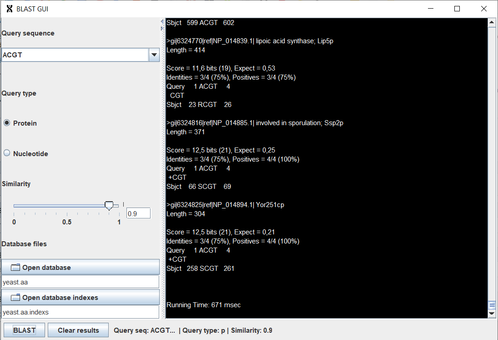

# Blast GUI

# Exercise

Blast is a program to search sequence matches in protein and nucleotid sequences. The goal of
this project is build a GUI for the provided version, which has a public method that allows to
make the queries. The query parameters are:
- The query type. The query can be for proteins or for nucleotid sequences.
- The data base file. The file containing the proteins or the nucleotid sequences where to
search for the matches.
- The data base indexes file. The file containing the indexes where the proteins begin in the
data base file.
- The similarity percentage. A float value between 0.0 and 1.0.
- The query sequence. A string that represents the protein or nucleotid sequence for which
the matches are search. Every aminoacid or nucleotid is represented by an uppercase letter.
For this project, the data base file and the data base indexes file will always be "yeast.aa" and
"yeast.aa.indexs", respectively.
  
The GUI will have to radio buttons for the user to choose the query type, one for proteins
and the other one for nucleotid sequences. The default option will be proteins.

The GUI will also have an editable combo box for the user to enter the query sequence. The
user can type a new query sequence or can choose among the previous query sequences. Every
time the user types a new sequence, the sequence is added as a new option to the combo box.
The GUI will also have a text field for the user to introduce the query percentage.
The GUI will also have a button that will make the query when the user presses it. The
parameters provided to the query method will be those provided by the user in the different GUI
elements.

The query result will be shown in text area and the user should be able to scroll through it.

## Problems

- [x] `JRadioButton`s should let select only one option (`JRadioButton`s were added to a `ButtonGroup`)
- [x] Need to get path of selected files (`JFileChooser` was used)
    - [x] Need to filer allowed `.index` files (`FileNameExtensionFilter` was used)
- [x] Needed to use `ActionLister`s for file choosing, and query button
- [x] Show results inside the window and not in the `System.out`. (`JScrollPane` and `JTextArea` were used to display the results)
    - [x] `JTextArea` overflown horizontally due to results columns, the solution was `.setLineWrap(true);`
- [x] Add icon tu `JFrame`. (Used `.setIconImage()`)
- [ ] Side menu's layout (`GridLayout`) is bad as the `JPanel` item stretch with window. Maybe the solution is `BoxLayout`.